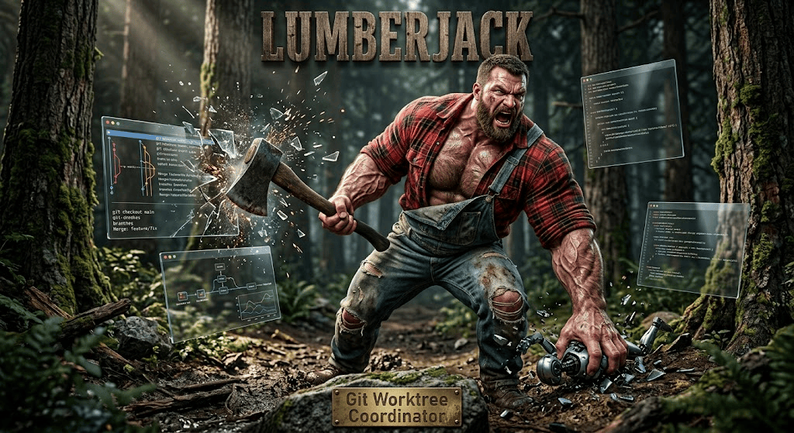

# Lumberjack

A typed harness for running a **swarm of AI agents in parallel git worktrees** over one
codebase, with first-class **awareness** of what every other agent is touching.

Worktrees solve isolation. They do nothing for coordination. Lumberjack is the
coordination layer.



See [docs/specs/0001_SPEC.md](docs/specs/0001_SPEC.md) for the full design.

## The idea in three sentences

Agents declare what they are about to touch, but declarations are only a prior: the
ground truth for conflict is `git merge-tree`, which performs a real merge between two
worktrees with no checkout in tens of milliseconds. Because git merges different
functions in one file cleanly, two agents holding `edit` on the same file is *allowed* --
what the harness adds is that each learns about the other. When they genuinely collide,
"the manager rules" and "the peers negotiate" are two implementations of one
`ArbitrationPolicy`, and the default runs the peers with a turn budget and lets the
foreman break the tie.

## Quickstart

```bash
uv sync
uv run lj init
uv run lj plan "add OTel tracing across the service layer"
uv run lj run  "add OTel tracing across the service layer" -n 4
uv run lj watch
```

| command | what it does |
|---|---|
| `lj init` | write `lumberjack.json`, prepare `.lumberjack/` |
| `lj plan` | scout the repo, decompose the goal, print the task graph |
| `lj run` | N agents, N worktrees, one integration branch |
| `lj status` | workstreams, leases, open conflicts, the merge train |
| `lj watch` | live dashboard |
| `lj conflicts --explain <id>` | the oracle's evidence for a conflict |
| `lj board` | the shared blackboard |
| `lj promote` | merge integration into the base branch -- the human gate |
| `lj replay <stand>` | the raw event log every projection folds over |
| `lj serve` | expose the coordination toolset over MCP |

Nothing lands on `main` automatically. Work merges onto `integration/<stand-id>`;
promotion is an explicit human step.

## Library use

```python
from lumberjack import ArbitrationMode, Stand, StandConfig

config = StandConfig(repo=Path("."), max_parallel=6, arbitration=ArbitrationMode.HYBRID)

async with Stand.open(config) as stand:
    outcome = await stand.run("add OTel tracing across the service layer")

print(outcome.summary())
```

`Stand.open` removes clean worktrees on exit and **preserves any worktree still holding
unlanded work**, reporting them in `outcome.preserved_worktrees`.

## Attaching an agent this project did not write

```bash
uv run lj serve --stand <stand-id>
```

An MCP-capable session started inside a worktree calls `join(agent=...)` and becomes a
first-class workstream: it claims, negotiates and lands under the same rules as the
built-in workers.

## Layout

```
src/lumberjack/
  domain/    pure types -- no I/O, no imports beyond pydantic and the stdlib
  ports/     Protocols for every I/O boundary
  core/      broker, oracle, sensor, digest, arbitration, merge train, supervisor
  adapters/  git CLI, SQLite ledger, ast indexer, command gate
  agents/    PydanticAI agents and the toolsets they act through
  server/    MCP surface
  cli/ tui/  operator surfaces
```

## Development

```bash
uv run ruff format --check .
uv run ruff check .
uv run ty check
uv run pytest
```

The suite runs entirely against `FunctionModel` -- no API key needed. One live test is
opt-in:

```bash
ANTHROPIC_API_KEY=... uv run pytest -m live
```
