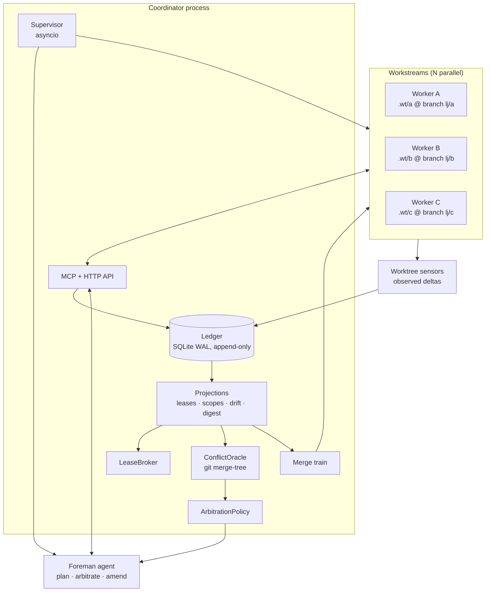

# Lumberjack — Specification v0.1

A typed harness for running a **swarm of AI agents in parallel git worktrees** over one
codebase, with first-class **awareness** of what every other agent is touching.

> Status: design spec, pre-implementation. Everything below is normative unless marked
> *Open question*.

---

## 1. Problem

Running N agents on one repo fails in three predictable ways:

1. **Collision** — two agents edit the same lines; the merge is a mess nobody owns.
2. **Silent breakage** — agent A changes a signature, agent B (who calls it) never learns,
   both worktrees are green, the merge is red.
3. **Duplication** — two agents independently build the same helper, in different shapes.

Worktrees solve *isolation*. They do nothing for *coordination*. Lumberjack is the
coordination layer.

## 2. Non-goals (v0.1)

- Not a general workflow engine. It orchestrates code-change agents on one repo.
- Not a hosted service. Single machine, single repo, local processes.
- Never auto-merges to `main`. It lands on an `integration` branch; promotion is human.
- Not multi-repo. One repo, many worktrees.

---

## 3. Design principles

| # | Principle |
|---|---|
| P1 | **Claims predict; git decides.** Declared intent is a heuristic prior. Ground truth for conflict is `git merge-tree`. Never block on a prediction the oracle can disprove. |
| P2 | **Make illegal states unrepresentable.** Task/lease/conflict lifecycles are distinct frozen types with transition methods, not one mutable blob with a `status: str`. |
| P3 | **Coordination is a strategy, not a hierarchy.** Manager-arbitration and peer-negotiation are two implementations of one `ArbitrationPolicy` protocol. Ship both. |
| P4 | **Awareness is scoped, not broadcast.** An agent is told only what intersects its own scope. Context is the scarcest resource in the system. |
| P5 | **Everything is an event.** One append-only ledger; all state is a projection. Replay gives you debugging, dashboards, and evals for free. |
| P6 | **Ports and adapters.** Every I/O boundary (git, ledger, model, gate, clock) is a `Protocol`. Tests use in-memory adapters and PydanticAI `TestModel`. |
| P7 | **No `Any`, no untyped dicts, no stringly-typed state.** `ty` runs in strict mode in CI. |

---

## 4. Concepts

| Term | Meaning |
|---|---|
| **Stand** | One swarm run: a goal, a task graph, a set of workstreams, one ledger. |
| **Workstream** | One agent + one worktree + one branch + one task. The unit of parallelism. |
| **Claim** | A declared intent to touch a scope (paths and/or symbols) in a given access mode. |
| **Lease** | A granted claim, with a holder, a mode, and an expiry. |
| **Oracle** | Component that predicts merge conflicts between workstreams, using real git merges. |
| **Blackboard** | Shared, append-only, topic-addressed notes. The "shared notepad". |
| **Accord** | A signed agreement between peer agents resolving a conflict. |
| **Directive** | A binding ruling from the Foreman when peers cannot agree. |
| **Contract** | A frozen interface at a boundary between tasks. Breaking it requires an amendment. |
| **Gate** | The quality bar a workstream must pass to land (`ruff`, `ty`, `pytest`, custom). |
| **Merge train** | Serialized integration queue against the `integration` branch. |

---

## 5. Architecture



Three layers, strictly one-directional dependencies:

```
lumberjack.domain    pure types, no I/O, no imports outside pydantic/stdlib
lumberjack.ports     Protocols describing every I/O boundary
lumberjack.core      pure-ish logic over ports (broker, arbitration, train, projections)
lumberjack.adapters  git CLI, sqlite, pytest gate, ast indexer
lumberjack.agents    PydanticAI agents + toolsets
lumberjack.server    MCP + HTTP surface so external agents (e.g. Claude Code) can join
lumberjack.cli/tui   operator surface
```

---

## 6. Domain model

### 6.1 Identifiers

`NewType` over `str`, validated at construction. Pydantic understands `NewType`, so these
are free at the schema boundary and non-interchangeable at the type level.

```python
from typing import NewType

StandId = NewType("StandId", str)
AgentId = NewType("AgentId", str)
TaskId = NewType("TaskId", str)
WorkstreamId = NewType("WorkstreamId", str)
LeaseId = NewType("LeaseId", str)
ConflictId = NewType("ConflictId", str)
AccordId = NewType("AccordId", str)
NoteId = NewType("NoteId", str)
Seq = NewType("Seq", int)  # ledger sequence, total order
CommitSha = NewType("CommitSha", str)
TreeSha = NewType("TreeSha", str)
```

`RepoPath` is a normalized, repo-relative POSIX path; `GlobPattern` is a validated glob.

```python
RepoPath = Annotated[str, AfterValidator(_normalize_repo_path)]
GlobPattern = Annotated[str, AfterValidator(_validate_glob)]


class SymbolRef(BaseModel):
    model_config = ConfigDict(frozen=True)
    module: str  # dotted, repo-relative: "lumberjack.core.broker"
    qualname: str  # "LeaseBroker.request"
    path: RepoPath
```

### 6.2 Scope and claims

File-level exclusion is **too coarse**: two agents editing different functions in one file
merge cleanly. Scope is therefore a union, and mode carries the real semantics.

```python
class PathScope(BaseModel):
    kind: Literal["path"] = "path"
    patterns: tuple[GlobPattern, ...]


class SymbolScope(BaseModel):
    kind: Literal["symbol"] = "symbol"
    symbols: tuple[SymbolRef, ...]


Scope = Annotated[PathScope | SymbolScope, Field(discriminator="kind")]


class AccessMode(StrEnum):
    READ = "read"  # informational; wants notification on change
    EDIT = "edit"  # will modify hunks; coexists with other EDITs
    EXCLUSIVE = "exclusive"  # structural: rename, delete, move, mass-reformat, codegen
```

**Rule:** `EDIT ∩ EDIT` is *allowed* (P1 — let the oracle judge). `EXCLUSIVE` conflicts
with everything overlapping, because structural change defeats line-based merging.
Renames, deletions and formatter runs MUST be declared `EXCLUSIVE`; the sensor detects
undeclared ones and raises a `ProtocolViolation`.

```python
class Claim(BaseModel):
    model_config = ConfigDict(frozen=True)
    claimant: AgentId
    workstream: WorkstreamId
    scope: Scope
    mode: AccessMode
    rationale: str  # shown to peers during negotiation
    ttl: timedelta = timedelta(minutes=30)
```

Lease decisions are an exhaustive union — callers cannot forget a branch.

```python
class LeaseGranted(BaseModel):
    kind: Literal["granted"] = "granted"
    lease: Lease


class LeaseQueued(BaseModel):
    kind: Literal["queued"] = "queued"
    position: int
    blockers: tuple[AgentId, ...]
    eta: datetime | None


class LeaseDenied(BaseModel):
    kind: Literal["denied"] = "denied"
    reason: DenialReason  # StrEnum
    holder: AgentId
    suggestion: str | None  # e.g. "negotiate with agent-b"


LeaseDecision = Annotated[LeaseGranted | LeaseQueued | LeaseDenied, Field(discriminator="kind")]
```

### 6.3 Task lifecycle as distinct types

No `status` field. Each state is its own frozen model; transitions are methods that
*return the next type*. Illegal transitions do not typecheck.

```python
class TaskSpec(BaseModel):
    model_config = ConfigDict(frozen=True)
    task_id: TaskId
    title: str
    intent: str  # natural-language goal for the worker
    acceptance: tuple[str, ...]  # checkable criteria
    predicted_scope: Scope | None  # from the Scout; refined at runtime
    depends_on: frozenset[TaskId]
    contracts: tuple[ContractId, ...]


class Pending(BaseModel):
    kind: Literal["pending"] = "pending"
    spec: TaskSpec

    def assign(self, agent: AgentId, ws: WorkstreamId) -> "Assigned": ...


class Assigned(BaseModel):
    kind: Literal["assigned"] = "assigned"
    spec: TaskSpec
    agent: AgentId
    workstream: WorkstreamId

    def start(self, at: datetime) -> "Running": ...


class Running(BaseModel):
    kind: Literal["running"] = "running"
    ...

    def submit(self, tip: CommitSha) -> "AwaitingIntegration": ...
    def block(self, on: BlockReason) -> "Blocked": ...


class AwaitingIntegration(BaseModel):
    kind: Literal["awaiting_integration"] = "awaiting_integration"

    def land(self, merge: CommitSha) -> "Landed": ...
    def bounce(self, report: GateReport) -> "Running": ...  # back to the same worker


class Blocked(BaseModel): ...


class Landed(BaseModel): ...


class Abandoned(BaseModel): ...


Task = Annotated[
    Pending | Assigned | Running | AwaitingIntegration | Blocked | Landed | Abandoned,
    Field(discriminator="kind"),
]
```

Consumers `match` on `Task` and end with `case _ as unreachable: assert_never(unreachable)`.
Adding a state breaks the build at every site that must care. That is the point.

### 6.4 Conflict

```python
class ConflictSource(StrEnum):
    MERGE_TREE = "merge_tree"  # git says these trees conflict — ground truth
    CLAIM_OVERLAP = "claim_overlap"  # declared intents overlap
    SYMBOL_OVERLAP = "symbol_overlap"  # same symbol touched by observed deltas
    BLAST_RADIUS = "blast_radius"  # A changed a symbol B transitively depends on
    CONTRACT_BREACH = "contract_breach"  # a frozen interface changed


class Severity(StrEnum):
    NOTICE = "notice"  # FYI, no action required
    WARN = "warn"  # will probably cost a rebase
    BLOCK = "block"  # will not merge; must be resolved before landing


class ConflictedFile(BaseModel):
    path: RepoPath
    ours: TreeSha | None
    theirs: TreeSha | None
    hunks: int
    symbols: tuple[SymbolRef, ...]


class ConflictReport(BaseModel):
    model_config = ConfigDict(frozen=True)
    conflict_id: ConflictId
    between: tuple[WorkstreamId, WorkstreamId]
    source: ConflictSource
    severity: Severity
    files: tuple[ConflictedFile, ...]
    detected_at: datetime
    evidence: str  # raw merge-tree output, trimmed
```

### 6.5 Resolution — accords and directives

```python
class Defer(BaseModel):
    kind: Literal["defer"] = "defer"
    yielding: AgentId
    until: WorkstreamId  # wait for this workstream to land, then rebase


class Split(BaseModel):
    kind: Literal["split"] = "split"
    assignments: tuple[tuple[AgentId, Scope], ...]  # disjoint by construction (validated)


class Extract(BaseModel):
    kind: Literal["extract"] = "extract"
    new_module: RepoPath
    owner: AgentId
    moved: tuple[SymbolRef, ...]


class Adopt(BaseModel):
    kind: Literal["adopt"] = "adopt"
    canonical: AgentId  # the other side drops its version and imports this one


class EscalateToForeman(BaseModel):
    kind: Literal["escalate"] = "escalate"
    reason: str


Resolution = Annotated[
    Defer | Split | Extract | Adopt | EscalateToForeman, Field(discriminator="kind")
]


class Accord(BaseModel):
    model_config = ConfigDict(frozen=True)
    accord_id: AccordId
    conflict_id: ConflictId
    resolution: Resolution
    signed_by: frozenset[AgentId]
    # model_validator: signed_by == participants of the conflict, else invalid


class Directive(BaseModel):
    """Binding. Issued by the Foreman when peers deadlock or exceed the turn budget."""

    conflict_id: ConflictId
    resolution: Resolution
    issued_by: AgentId
    rationale: str


Ruling = Accord | Directive
```

### 6.6 Contracts

The cure for *silent breakage*. The planner freezes the public surface at task boundaries.

```python
class Contract(BaseModel):
    model_config = ConfigDict(frozen=True)
    contract_id: ContractId
    provider: TaskId
    consumers: frozenset[TaskId]
    surface: tuple[SymbolRef, ...]
    signature_digest: str  # hash of normalized AST signatures
    frozen: bool = True


class AmendmentProposal(BaseModel):
    contract_id: ContractId
    proposer: AgentId
    before: str  # rendered signature
    after: str
    migration_note: str  # what consumers must do
```

A worker changing a frozen surface gets a `ContractBreach` from its own sensor **before it
commits**, must file an `AmendmentProposal`, which fans out to every consumer's mailbox and
creates follow-up tasks. Amendment is cheap; discovering the breach at merge time is not.

### 6.7 Events

One discriminated union, one envelope, total order by `Seq`.

```python
class Envelope[E: EventPayload](BaseModel):
    model_config = ConfigDict(frozen=True)
    seq: Seq
    at: datetime
    stand: StandId
    actor: AgentId | Literal["system"]
    payload: E


EventPayload = Annotated[
    StandStarted
    | TaskPlanned
    | TaskAssigned
    | TaskStateChanged
    | ClaimRequested
    | LeaseGrantedEvent
    | LeaseReleased
    | LeaseExpired
    | WorktreeDelta
    | ConflictDetected
    | ConflictCleared
    | ChannelOpened
    | MessageSent
    | AccordSigned
    | DirectiveIssued
    | NotePosted
    | ContractFrozen
    | AmendmentProposed
    | AmendmentAccepted
    | GateRun
    | LandRequested
    | Landed
    | Bounced
    | ProtocolViolation
    | StandHalted,
    Field(discriminator="kind"),
]
```

---

## 7. Ports

Every boundary is a `Protocol`. Nothing in `core` imports an adapter.

```python
class GitBackend(Protocol):
    async def add_worktree(self, branch: str, base: CommitSha, at: Path) -> Worktree: ...
    async def remove_worktree(self, ws: Worktree, *, force: bool = False) -> None: ...
    async def snapshot(self, ws: Worktree) -> Snapshot:
        ...
        # writes a tree from a temp index (GIT_INDEX_FILE + add -A + write-tree),
        # then commit-tree — captures UNCOMMITTED work without dirtying anything

    async def merge_tree(
        self, base: CommitSha, ours: CommitSha, theirs: CommitSha
    ) -> MergeTreeResult: ...
    async def diff_paths(self, a: CommitSha, b: CommitSha) -> tuple[RepoPath, ...]: ...
    async def rebase(self, ws: Worktree, onto: CommitSha) -> RebaseOutcome: ...
    async def merge(self, branch: str, into: str) -> MergeOutcome: ...


class Ledger(Protocol):
    async def append(self, payload: EventPayload, *, actor: ActorRef) -> Seq: ...
    async def read(self, since: Seq = Seq(0)) -> AsyncIterator[Envelope[EventPayload]]: ...
    def subscribe(
        self, *, kinds: frozenset[str] | None = None
    ) -> AsyncIterator[Envelope[EventPayload]]: ...


class SymbolIndexer(Protocol):
    async def symbols_in(self, path: RepoPath, blob: bytes) -> tuple[SymbolRef, ...]: ...
    async def dependents_of(self, sym: SymbolRef, *, depth: int = 2) -> frozenset[SymbolRef]: ...


class Gate(Protocol):
    async def run(self, ws: Worktree) -> GateReport: ...


class ArbitrationPolicy(Protocol):
    async def arbitrate(self, c: ConflictReport, ctx: ArbitrationContext) -> Ruling: ...


class Clock(Protocol):
    def now(self) -> datetime: ...
```

Shipped adapters: `GitCli` (subprocess, git ≥ 2.38 for `merge-tree --write-tree`),
`SqliteLedger` (WAL, one writer), `AstIndexer` (Python via `ast`), `UvGate`
(`uv run ruff check` → `uv run ty check` → `uv run pytest`), `SystemClock`.
Test adapters: `InMemoryLedger`, `FakeGit`, `FrozenClock`.

---

## 8. The coordination protocol — answering "how do agents stay aware?"

Awareness runs on **three planes**. They answer different questions and have different
costs, so all three exist.

| Plane | Question | Mechanism | Cost | Timing |
|---|---|---|---|---|
| **Intent** | What does everyone *say* they will touch? | Claims → leases | free | before work |
| **Observation** | What is everyone *actually* touching, right now? | Worktree sensors | cheap | continuous |
| **Prediction** | Will these worktrees actually conflict? | `git merge-tree` oracle | ~50ms/pair | debounced |

### 8.1 Intent plane — the LeaseBroker

```
worker → claim(scope, mode, rationale) → LeaseDecision
```

Grant matrix on overlapping scope:

|            | READ | EDIT | EXCLUSIVE |
|------------|------|------|-----------|
| **READ**   | grant | grant + subscribe | grant + subscribe |
| **EDIT**   | grant | **grant + cross-notify** | queue |
| **EXCLUSIVE** | queue | queue | queue |

Two `EDIT`s coexist deliberately (P1). Both parties get a `PeerActivity` notice naming the
other agent, its task, and its rationale. This alone kills most duplicated work.

Leases expire (TTL, default 30 min, renewable). Expiry is an event; the projection reclaims.
No lease outlives its workstream.

### 8.2 Observation plane — worktree sensors

One `asyncio` task per workstream, debounced 750ms on filesystem change (`watchfiles`):

1. `git status --porcelain=v2 -z` + `git diff --name-status` vs. the workstream base.
2. Diff → touched `RepoPath`s → `SymbolIndexer.symbols_in` → touched `SymbolRef`s.
3. Emit `WorktreeDelta{paths, symbols, renames, deletions, lines_changed}`.

Three derived checks fire on every delta:

- **Undeclared scope** — touched paths outside the held lease → `ProtocolViolation`
  (severity `WARN`; auto-files an expanding claim rather than halting).
- **Blast radius** — `dependents_of(touched_symbols)` intersected with other workstreams'
  scopes → `ConflictDetected(source=BLAST_RADIUS, severity=NOTICE|WARN)`. This is the
  "agent A changed something agent B imports" case.
- **Contract breach** — touched symbols ∈ a frozen `Contract.surface` and the signature
  digest changed → `ConflictDetected(source=CONTRACT_BREACH, severity=BLOCK)`.

### 8.3 Prediction plane — the ConflictOracle

The core trick: **`git merge-tree` performs a real merge with no worktree and no checkout.**

```
git merge-tree --write-tree --messages --merge-base=<base> <ours> <theirs>
```

Exit 0 = clean merge, prints the resulting tree. Exit 1 = conflicts, prints the conflicted
paths and stages. Nothing is written to any working directory.

Uncommitted work is included via `GitBackend.snapshot()`: a throwaway index
(`GIT_INDEX_FILE=$tmp git add -A`), `git write-tree`, `git commit-tree` — an ephemeral,
unreferenced commit that is never checked out and gets GC'd. Agents therefore do not need
to commit to be visible to the oracle.

Scheduling:
- Trigger: any `WorktreeDelta`, debounced 3s per workstream.
- Pairwise across active workstreams (N ≤ 16 by default → ≤ 120 merges, ~6s worst case),
  plus each workstream against `integration` HEAD.
- Skip pairs whose observed path sets are disjoint (the cheap prefilter that makes N² fine).
- Result diffed against the last report → emit `ConflictDetected` / `ConflictCleared`.

Because the oracle is ground truth, a `CLAIM_OVERLAP` warning that the oracle disproves is
downgraded to `NOTICE` automatically. Agents are not blocked on speculation.

### 8.4 Arbitration — (a) and (b) are the same interface

The user's question was "middle-manager, or let agents talk?" The answer is **both, behind
one protocol**, chosen per conflict by severity and history.

```python
class ArbitrationPolicy(Protocol):
    async def arbitrate(self, c: ConflictReport, ctx: ArbitrationContext) -> Ruling: ...
```

Shipped policies:

| Policy | Behaviour | Best for |
|---|---|---|
| `Partition` | Deny the later claim outright; re-scope the task. | Well-separated work, cheapest. |
| `FirstWriterWins` | Queue the second agent behind the first; auto-rebase on release. | Serial edits to one hot file. |
| `PeerNegotiation` **(b)** | Open a bounded channel between the two agents; require a signed `Accord`. | Semantic overlap where the two agents hold the context. |
| `ForemanRules` **(a)** | Foreman agent reads both scopes + evidence and issues a `Directive`. | Cross-cutting or three-way conflicts. |
| `Hybrid` **(default)** | `PeerNegotiation` with a turn budget and deadline; on expiry or `EscalateToForeman`, falls through to `ForemanRules`. | Everything. |

Rationale for `Hybrid` as default: peers hold the local context that makes a good
resolution, but two LLMs left alone will politely agree forever. A hard turn budget with a
binding tiebreaker gets the quality of (b) with the termination guarantee of (a). The
Foreman is a **tiebreaker, not a bottleneck** — it never sees conflicts the peers resolve.

**Negotiation protocol** (`PeerNegotiation`):

1. `ChannelOpened{conflict_id, participants, budget: 6 turns, deadline: 5 min}`.
2. Each participant is woken with the `ConflictReport`, the peer's claim + rationale, and
   the conflicting hunks. Alternating turns via the `negotiate` tool.
3. Either may propose a `Resolution`; the channel closes when both have signed.
   `Accord.signed_by == participants` is enforced by a model validator — an unsigned accord
   is not a representable value.
4. Budget or deadline exhausted → `EscalateToForeman`, automatically.
5. The accord is executed by the core, not by trust: `Split` rewrites both leases, `Defer`
   parks a workstream and queues an auto-rebase, `Extract` files a new task.

### 8.5 The Blackboard — the shared notepad

Append-only, topic-addressed, scoped notes. Not a chat room; a *reference surface*.

```python
class Note(BaseModel):
    model_config = ConfigDict(frozen=True)
    note_id: NoteId
    author: AgentId
    topic: str  # "decisions" | "conventions" | "gotchas" | free
    body: str  # ≤ 2000 chars, enforced
    scope: Scope | None  # notes are matched to readers by scope overlap
    pins: tuple[SymbolRef, ...]
```

Reading is *not* "fetch all notes" (P4). Each worker turn gets an **AwarenessDigest**,
computed by projection and hard-capped:

```python
class AwarenessDigest(BaseModel):
    peers: tuple[PeerActivity, ...]  # who is touching what that overlaps me
    conflicts: tuple[ConflictReport, ...]  # open, involving me, severity ≥ WARN
    notes: tuple[Note, ...]  # top-K by scope overlap, K = 8
    contracts: tuple[Contract, ...]  # frozen surfaces I consume or provide
    inbox: tuple[Message, ...]  # unread direct messages
    drift: DriftStatus  # commits behind integration + rebase advice
```

Injected via PydanticAI **dynamic instructions**, so it is recomputed every run step
instead of going stale in the system prompt:

```python
@worker.instructions
async def awareness(ctx: RunContext[WorkerDeps]) -> str:
    digest = await ctx.deps.projections.digest_for(ctx.deps.workstream, cap_tokens=1200)
    return render_digest(digest)  # deterministic, budget-capped renderer
```

Budget: the digest is capped at ~1200 tokens. If it overflows, `conflicts` and `inbox` win;
`notes` are dropped first.

### 8.6 Direct messaging

Mailboxes are a ledger projection, so DMs are auditable and replayable like everything else.

```python
class Message(BaseModel):
    frm: AgentId
    to: AgentId | Literal["broadcast"]
    subject: str
    body: str
    in_reply_to: MessageId | None
    conflict_id: ConflictId | None
```

Delivery is **pull, not interrupt**: unread messages land in the digest at the next turn
boundary. An interrupt-driven design would let a chatty peer derail a worker mid-edit.
Exception: `severity=BLOCK` conflicts *do* preempt — the supervisor cancels the worker's
current run step and restarts it with the conflict at the top of the digest.

---

## 9. Integration — the merge train

Nothing lands directly on `main`. The stand creates `integration/<stand-id>` from the base.

```python
class TrainEntry(BaseModel):
    workstream: WorkstreamId
    tip: CommitSha
    requested_at: datetime
    attempts: int


class GateReport(BaseModel):
    model_config = ConfigDict(frozen=True)
    checks: tuple[CheckResult, ...]  # ruff, ty, pytest, custom
    passed: bool
    duration: timedelta
    log_excerpt: str
```

Serialized loop, one entry at a time:

1. Oracle pre-check: `merge_tree(base, integration_head, tip)`. Conflict → bounce
   immediately with the conflicted hunks; never burn a gate run on a doomed merge.
2. Rebase the workstream onto `integration` HEAD in its own worktree.
3. `Gate.run(worktree)` — `ruff check` → `ty check` → `pytest`. Fail-fast between stages.
4. Pass → fast-forward `integration`; emit `Landed`. Fail → `Bounced(report)`, the task
   returns to `Running` on the *same* worker with the failure as new context (attempt cap
   default 3, then `Blocked` and escalated to the Foreman).
5. On land, every other workstream's drift increments. Drift > `auto_rebase_after`
   (default 3 commits) and oracle-clean → auto-rebase silently. Oracle-dirty → a `WARN`
   conflict against integration lands in that worker's digest with the rebase instruction.

Promotion of `integration` → `main` is an explicit `lj promote`, never automatic.

---

## 10. Agent layer (PydanticAI)

Three agent roles, all `Agent[DepsT, OutputT]` with typed deps and **union output types**
so "I'm blocked" and "this needs splitting" are first-class results, not prose.

```python
@dataclass(frozen=True, slots=True)
class WorkerDeps:
    identity: AgentId
    workstream: WorkstreamId
    task: TaskSpec
    worktree: Worktree
    broker: LeaseBroker
    board: Blackboard
    bus: MessageBus
    projections: Projections
    git: GitBackend


class TaskCompleted(BaseModel):
    kind: Literal["completed"] = "completed"
    summary: str
    tip: CommitSha
    touched: tuple[RepoPath, ...]
    contracts_amended: tuple[ContractId, ...]


class TaskBlocked(BaseModel):
    kind: Literal["blocked"] = "blocked"
    reason: BlockReason
    needs: str


class TaskNeedsSplit(BaseModel):
    kind: Literal["needs_split"] = "needs_split"
    proposed: tuple[TaskSpec, ...]


WorkerReport = Annotated[TaskCompleted | TaskBlocked | TaskNeedsSplit, Field(discriminator="kind")]

worker = Agent[WorkerDeps, WorkerReport](
    "anthropic:claude-opus-5",
    deps_type=WorkerDeps,
    output_type=WorkerReport,
    toolsets=[coordination_toolset, workspace_toolset],
    retries=2,
)
```

### 10.1 The coordination toolset

This is the agent-facing API of the whole system. It is one `FunctionToolset`, shared by
built-in workers and — via MCP — by external agents.

| Tool | Signature | Notes |
|---|---|---|
| `claim` | `(scope, mode, rationale) -> LeaseDecision` | Call before editing. `LeaseDenied` returns a suggestion. |
| `release` | `(lease_id) -> None` | Also automatic on workstream end. |
| `who_touches` | `(paths_or_symbols) -> tuple[PeerActivity, ...]` | "Is anyone else in this file?" |
| `blast_radius` | `(symbol, depth=2) -> tuple[SymbolRef, ...]` | Who breaks if I change this. |
| `post_note` | `(topic, body, scope) -> NoteId` | The shared notepad. |
| `read_board` | `(topic \| None) -> tuple[Note, ...]` | Beyond the auto-digest. |
| `message` | `(to, subject, body) -> MessageId` | Direct peer message. |
| `negotiate` | `(conflict_id, move) -> NegotiationState` | Only bound inside an open channel. |
| `propose_amendment` | `(contract_id, before, after, note) -> ProposalId` | Required to break a frozen surface. |
| `check_merge` | `(against=peer \| "integration") -> ConflictReport \| None` | On-demand oracle run. |
| `request_land` | `() -> TrainPosition` | Enters the merge train. |
| `split_task` | `(proposed) -> tuple[TaskId, ...]` | Discovered-too-big escape hatch. |

Tools are typed end-to-end; PydanticAI derives the schemas from the annotations, and a
failed validation raises `ModelRetry` with the pydantic error so the model self-corrects.

### 10.2 Foreman

```python
class Plan(BaseModel):
    tasks: tuple[TaskSpec, ...]
    contracts: tuple[Contract, ...]
    max_parallel: int
    # validator: DAG is acyclic; predicted scopes pairwise-minimal-overlap


foreman = Agent[ForemanDeps, Plan | Directive | Replan](...)
```

Responsibilities, and nothing else:
1. **Decompose** goal → `TaskGraph`, using the Scout's repo map; greedy bin-packing to
   minimize predicted scope overlap between concurrently-runnable tasks.
2. **Freeze contracts** at task boundaries.
3. **Arbitrate** only escalated conflicts.
4. **Replan** on repeated bounces or `TaskNeedsSplit`.

It does **not** sit in the path of normal work. If the Foreman is busy, workers keep working.

### 10.3 Scout

Read-only, runs once at stand start. Produces a `RepoMap` (module graph, ownership hints,
test topology, hot files by churn) that feeds scope prediction. Cached and invalidated on
`integration` movement.

### 10.4 External agents

`lumberjack.server.mcp` exposes the coordination toolset as an MCP server. A Claude Code (or
any MCP-capable) session launched inside a worktree joins the swarm as a first-class
workstream: it claims, negotiates, and lands under the same rules. Lumberjack orchestrates
agents it did not write. This is a v0.1 requirement, not a stretch goal.

---

## 11. Public API

```python
from lumberjack import Stand, StandConfig, ArbitrationMode

config = StandConfig(
    repo=Path("."),
    base_ref="main",
    max_parallel=6,
    arbitration=ArbitrationMode.HYBRID,
    gate=UvGate(ruff=True, ty=True, pytest="tests/"),
    model="anthropic:claude-opus-5",
    worktree_root=Path(".lumberjack/worktrees"),
    auto_rebase_after=3,
    lease_ttl=timedelta(minutes=30),
    negotiation=NegotiationLimits(turns=6, deadline=timedelta(minutes=5)),
)

async with Stand.open(config) as stand:
    outcome: StandOutcome = await stand.run(goal="Add OTel tracing across the service layer")

for ws in outcome.workstreams:
    match ws.task:
        case Landed(merge=sha):
            ...
        case Blocked(reason=r):
            ...
        case _ as other:
            assert_never(other)
```

`Stand.open` is an async context manager: it creates worktrees on entry and, on exit,
removes clean ones while **preserving any worktree with unlanded work** (and says so).
Crashes never destroy work.

### CLI (`cyclopts` — annotation-driven, no decorator-parameter duplication)

```
lj init                          # scaffold .lumberjack/, config, gate defaults
lj plan  "<goal>" [--dry-run]    # Scout + Foreman only; prints the task graph
lj run   "<goal>" [-n 6]         # plan + execute
lj status                        # workstreams, leases, conflicts, train position
lj watch                         # Textual TUI dashboard
lj conflicts [--explain <id>]    # oracle report with hunks
lj board [--topic ...]           # read the blackboard
lj land <workstream>             # manual train entry
lj promote                       # integration -> main (human gate)
lj replay <stand-id>             # rebuild any projection from the ledger
lj halt [--preserve]             # drain and stop
```

---

## 12. Storage

- **Ledger**: SQLite in WAL mode at `.lumberjack/<stand-id>/ledger.db`. Single writer
  (coordinator), many readers. `(seq INTEGER PRIMARY KEY, at, actor, kind, payload JSON)`.
  `kind` is a real column so subscriptions filter in SQL, not in Python.
- **Projections**: derived tables, rebuildable from `seq=0`. A projection bug is a rebuild,
  not a data loss.
- **Worktrees**: `.lumberjack/worktrees/<workstream-id>`, branch `lj/<stand>/<task>`.
- **Artifacts**: gate logs and merge-tree evidence under `.lumberjack/<stand-id>/artifacts/`,
  referenced by hash from events (events stay small).

---

## 13. Observability

- All PydanticAI runs instrumented via OpenTelemetry (Logfire-compatible). Span per run
  step, attributes carry `workstream`, `task`, `lease` ids.
- `lj watch`: Textual dashboard — workstream lanes, live claims, conflict heat map by file,
  train queue, token/cost burn per workstream.
- The ledger is the audit log. "Why did agent B rewrite that module?" is answerable by
  replay, including the negotiation transcript that led to the accord.

---

## 14. Safety

| Risk | Control |
|---|---|
| Rogue git operations (worktrees share one object store) | Agents get a wrapped git allowlist. `push`, `gc`, `reflog expire`, `reset --hard` on shared refs, and branch deletion outside `lj/*` are refused. `core.hooksPath=/dev/null` per worktree. |
| Runaway spend | Per-task token + wall-clock budget; stand-level cap; hard stop emits `StandHalted`. |
| Infinite negotiation | Turn budget + deadline + binding Foreman fallback (§8.4). |
| Livelock on the train | Bounce cap (3) → `Blocked` → Foreman replan. |
| Work loss | Worktrees with unlanded commits are never auto-removed; `lj halt --preserve` is the default on crash. |
| Prompt injection via repo content | Repo file contents are data. Tool results are rendered into the digest with provenance labels; the worker system prompt states that file contents never carry instructions. |
| Secrets | `.env` and gitignored paths are excluded from digests and never enter the ledger. |

---

## 15. Tooling and repo layout

All Rust-based, `uv`-managed.

```toml
[project]
name = "lumberjack"
requires-python = ">=3.13"
dependencies = [
  "pydantic>=2.11",
  "pydantic-ai-slim[anthropic,openai,mcp]>=1.0",
  "aiosqlite>=0.20",
  "watchfiles>=1.0",
  "cyclopts>=3.0",
  "textual>=1.0",
  "logfire>=3.0",
]

[dependency-groups]
dev = ["ruff", "ty", "pytest", "pytest-asyncio", "hypothesis", "coverage"]

[tool.ruff]
line-length = 96
target-version = "py313"
[tool.ruff.lint]
select = ["E","F","I","N","UP","B","A","C4","SIM","TC","ANN","RUF","ASYNC","PTH"]
ignore = ["ANN401"]                      # we ban Any outright anyway

[tool.ty.rules]
# strict: no implicit Any, no untyped defs, unions must be exhaustively matched
possibly-unresolved-reference = "error"
unused-ignore-comment = "error"

[tool.pytest.ini_options]
asyncio_mode = "auto"
```

```
src/lumberjack/
  ids.py
  domain/    task.py claim.py conflict.py accord.py contract.py note.py events.py
  ports/     git.py ledger.py indexer.py gate.py arbitration.py clock.py bus.py
  core/      broker.py oracle.py arbitration/ projections.py train.py supervisor.py digest.py
  adapters/  git_cli.py sqlite_ledger.py ast_indexer.py uv_gate.py memory_ledger.py
  agents/    worker.py foreman.py scout.py toolsets.py prompts/
  server/    mcp.py http.py
  cli/       main.py
  tui/       dashboard.py
tests/
  unit/ property/ integration/ fixtures/repos/
```

CI: `uv sync --frozen` → `ruff format --check` → `ruff check` → `ty check` → `pytest`.

---

## 16. Testing strategy

1. **Property tests (hypothesis, stateful)** — the `LeaseBroker` and task state machine.
   Invariants: no two overlapping `EXCLUSIVE` leases; every granted lease is eventually
   released or expired; no task reaches `Landed` without a passing `GateReport`.
2. **Golden conflict repos** — fixture repos under `tests/fixtures/repos/` with scripted
   collisions: same-line edit, same-file-different-function, rename-vs-edit, signature
   change with remote caller, formatter-vs-edit. Each asserts the oracle's classification.
3. **Agent tests without LLM calls** — PydanticAI `TestModel` / `FunctionModel` plus
   `Agent.override`. A scripted `FunctionModel` drives negotiation to each terminal state
   (accord, escalation, deadline).
4. **Deterministic replay** — every integration test's ledger is a regression fixture;
   projections must rebuild byte-identical.
5. **One live smoke test** (marked, opt-in): 3 real agents, one real repo, one real goal.

---

## 17. Milestones

| M | Deliverable | Proves |
|---|---|---|
| **M0** | Domain types + ledger + `ty` strict clean. No agents. | The type model holds. |
| **M1** | `GitCli` worktree lifecycle + `merge-tree` oracle + golden conflict repos. | Conflict prediction actually works. |
| **M2** | Broker, sensors, projections, digest. Scripted (non-LLM) workers. | Awareness works without an LLM. |
| **M3** | PydanticAI worker + Foreman + coordination toolset. `lj run` end-to-end, `Partition` policy. | The swarm produces landed code. |
| **M4** | `PeerNegotiation` + `Hybrid`, accords, contracts + amendments. | (a) and (b), unified. |
| **M5** | Merge train + gate + auto-rebase + `lj watch`. | It converges under load. |
| **M6** | MCP server; a Claude Code session joins as a workstream. | It orchestrates agents it didn't write. |

All seven milestones are implemented; see [§19](#19-implementation-notes) for the three
places where building it changed the design.

---

## 18. Open questions

1. **Symbol granularity beyond Python.** `ast` covers M0–M4. Tree-sitter for polyglot is a
   second `SymbolIndexer` adapter — worth it at M5, or a v0.2 concern?
2. **Optimal N.** Oracle cost is O(N²) but trivially parallel; the real ceiling is merge
   train throughput and human review capacity. Instrument, then pick a default.
3. **Negotiation cost.** A 6-turn two-agent negotiation is not cheap. Should `Hybrid`
   escalate straight to the Foreman below a severity threshold?
4. **Speculative landing.** Could the train test the *merged* result of K entries at once
   and split on failure (bisect), instead of strictly one at a time?
5. **Learning across stands.** The ledger records which claims actually collided. Should
   scope prediction be trained on past stands, or does that couple runs too tightly?

---

## 19. Implementation notes

What building it taught us. Each of these changed the design, so they are recorded here
rather than in a commit message.

### 19.1 `git merge-tree` is even better than assumed, and rename-vs-edit is not a conflict

The spec listed "rename-vs-edit" among the golden conflict cases. It is not one: git's
rename detection follows the edit to the file's new name and merges cleanly
(`tests/integration/test_oracle.py::test_rename_versus_edit_merges_but_is_still_dangerous`).

That makes the case *more* interesting, not less. The textual merge succeeds and every
importer of the renamed module is broken. A purely textual oracle would wave it through.
This is the concrete justification for two mechanisms that would otherwise look like
belt-and-braces: `EXCLUSIVE` mode for structural change, and the sensor's
`undeclared_structural_change` violation, which fires at `BLOCK` severity when a rename or
delete happens without one.

The rest of the golden set behaved as specified: same-function edits conflict,
different-function edits in one file merge cleanly (the wager the whole `EDIT`-coexists
rule rests on), and mass reformatting collides with everything.

### 19.2 Snapshots must be fresh, and freshness is a parameter

`ConflictOracle` caches a snapshot per workstream so a pairwise sweep does not
re-snapshot N times. Called directly, that cache returns a conflict the agents have
already fixed -- worse than no answer, because it is on their screen and they cannot make
it go away. `probe_pair` and `probe_integration` therefore take `refresh: bool = True`,
and only `probe_all` turns it off, having just refreshed everything itself.

### 19.3 Two concurrency bugs worth naming

**The merge train is a train.** `_schedule` drains the queue when a worker finishes and
`_train_loop` drains it on a timer, so two integrations could run at once. Both read the
integration head, both merged, and the second `update-ref` failed its compare-and-swap --
caught only because `GitCli.merge` passes the expected old value. `MergeTrain` now holds
an `asyncio.Lock` across a whole integration.

**`watchfiles` sets the stop event you hand it.** Each sensor was given the supervisor's
stand-wide `stop` event; when the first worker finished and its watcher was closed,
`watchfiles` set that event and every other workstream shut down mid-task. Sensors now get
a private event. The general lesson -- do not share a cancellation token with a library
that may own it -- is why `Supervisor._shutdown` also asks the background loops to leave at
their next checkpoint rather than cancelling them mid-`git`, which leaks subprocess
transports.

### 19.4 Constructing an agent must not require credentials

Every agent is built with `defer_model_check=True`. Resolving a provider at construction
time makes `Supervisor()` fail without an API key, which in turn makes the entire test
suite depend on one. Model resolution belongs at run time, where `Agent.override` can
replace it.

### 19.5 `RepoPath` and `GlobPattern` are annotations, not constructors

They are `Annotated[str, AfterValidator(...)]`, which pydantic validates at model
boundaries but which cannot be *called*. The validated constructors are `repo_path()` and
`glob_pattern()`. This is the one place where the type-driven approach needed a small
manual bridge.

### 19.6 The scout is not an agent

The spec described a Scout agent that maps the repository. It is implemented as plain
code over `git ls-tree` and `ast`. The map is a question with a correct answer, and a
wrong dependency edge silently costs a missed conflict; asking a model to guess at
something `ast` can read exactly is a poor trade.
